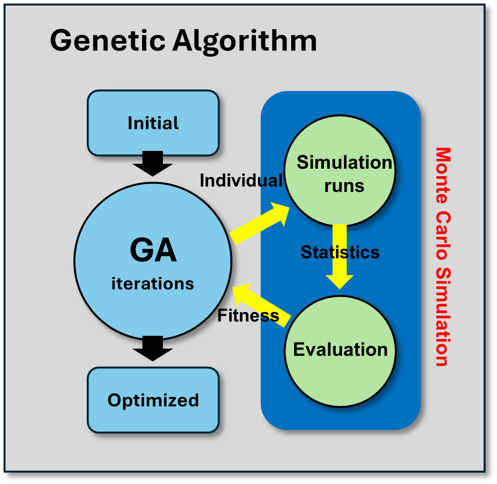

# AGV Automated Parking Facility Simulation
Operation Simulation of an AGV automated parking facility and optimization of parking space allocation

<h2>AGV Automated Parking</h2>

<h2>Decisions in the Operation of the Parking Facility</h2>

<h2>Program Architecture</h2>

<h2>Program Diagram</h2>

